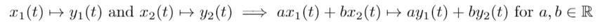
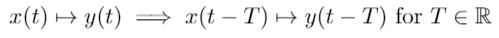
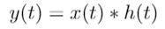

# SignalReverb

Disclaimer: I started this project because I wanted to see what my favorite songs would sound like in various different concert halls, venues, stadiums, etc. This is purely an exploratory project and is by no means comprehensive.

## Background
Indoor music venues can be thought of as Linear and Time Invariant (LTI) systems. LTI systems have 2 defining properties:
* Linearity: There is a linear mapping between the input and output

* Time Invariance: Delaying an input by T delays the output by T

The key advantage in being able to work with an LTI system is that it is characterized entirely by its impulse response. That is, the output of the system y(t) is the convolution (\*) of the input x(t) with the system's impulse response h(t)

However, convolutions can get expensive as the lengths of the signal and impulse responses grow, requiring  multiplication/addition operations. We can invoke the Convolution Theorem and make use of the fact that convolution in the time domain is multiplication (element-wise) in the frequency domain (and vice versa). So, our strategy is to compute the Fast Fourier Transform (FFT) in  operations, do the element-wise multiplication in  operations, and then compute the Inverse Fast Fourier Transform (IFFT) in  operations.

Thus, by acquiring an impulse response (could be a balloon pop, gunshot sound, etc.) to determine the acoustic qualities of the venue, we can simulate how our favorite songs would sound in that venue!
